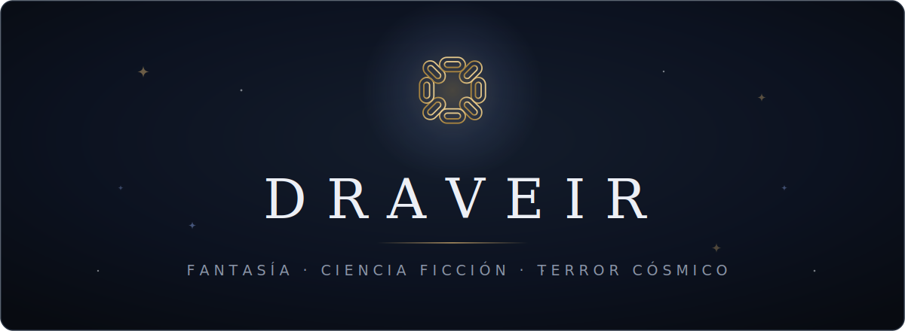

<div align="center">



<br>
<br>

**[draveir.com](https://draveir.com)**

<sub>En el lugar donde brillan las estrellas.</sub>

</div>

<br>

## Sobre el proyecto

Sitio de lectura hecho a medida: catálogo por sagas y fases, capítulos que se
liberan en su fecha y una experiencia de lectura pensada para textos largos —
oscura por defecto, sin distracciones y sin nada que se interponga entre el
lector y la página.

Estático de principio a fin. El contenido vive fuera del repositorio y se
compila en cada despliegue.

## Stack

<p>
  
  
  
  
</p>

Tipografía **Fraunces · Literata · Inter**. Sin framework de UI, sin CSS
framework, sin estado global. HTML y CSS.

## Desarrollo

```bash
cd web
npm install
npm run dev
```

> [!NOTE]
> El contenido lo genera `npm run sync` desde Notion; sin credenciales, el
> sitio arranca vacío.

| Comando | |
| --- | --- |
| `npm run dev` | servidor local |
| `npm run build` | build de producción |
| `npm run preview` | previsualizar el build |
| `npm run check` | comprobación de tipos |
| `npm test` | tests |

## Estructura

```
web/
├── src/
│   ├── pages/        rutas
│   ├── components/   piezas de UI
│   ├── layouts/      esqueleto de página
│   ├── lib/          lógica pura (+ sus tests)
│   └── styles/       tokens y estilos base
├── functions/        funciones de Cloudflare
└── scripts/          utilidades de mantenimiento
```

## Licencia

> [!IMPORTANT]
> El código es de libre consulta. **Las historias no**: los textos, títulos,
> personajes y mundos publicados en draveir.com son obra propia y están
> protegidos por derechos de autor. Todos los derechos reservados.

<div align="center">
<br>

<sub>✦ Escrito y construido por <b>Félix Llerena</b> · <b>Draveir</b> ✦</sub>

</div>
